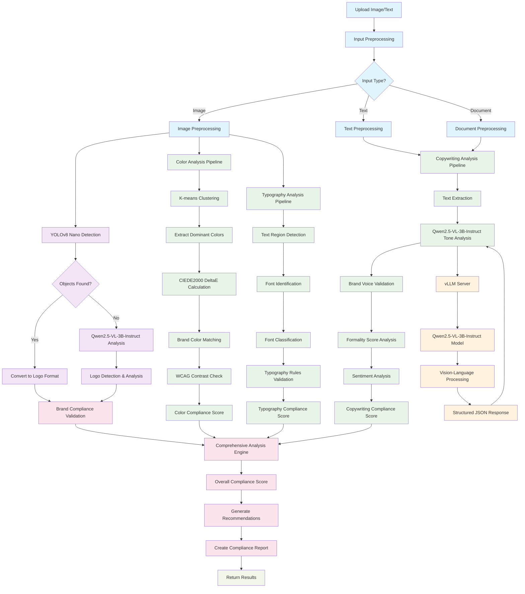

# Complete Brand Compliance Detection Flow

This document provides a comprehensive flow diagram that includes all components of the BrandGuard pipeline, including the missing elements you mentioned: K-means + deltaE for color analysis, tone detection, typography detection, and vLLM for inference.

## Complete Detection Flow Diagram

## Detailed Component Breakdown

### 1. **Color Analysis Pipeline**
- **K-means Clustering**: Groups similar colors in the image
- **CIEDE2000 DeltaE**: Calculates perceptual color differences
- **Brand Color Matching**: Compares extracted colors with brand palette
- **WCAG Contrast Check**: Validates accessibility compliance

### 2. **Typography Analysis Pipeline**
- **Text Region Detection**: Identifies text areas in the image
- **Font Identification**: Recognizes font families and styles
- **Typography Rules Validation**: Checks against brand guidelines
- **Compliance Scoring**: Generates typography compliance metrics

### 3. **Copywriting Analysis Pipeline**
- **Text Extraction**: Extracts text from images/documents
- **Qwen2.5-VL-3B-Instruct**: Advanced tone and sentiment analysis
- **Brand Voice Validation**: Ensures content matches brand personality
- **Multi-dimensional Analysis**: Formality, sentiment, warmth, energy scores

### 4. **Logo Detection Pipeline**
- **YOLOv8 Nano**: Fast object detection for logos
- **Qwen2.5-VL-3B-Instruct**: Advanced logo analysis and context understanding
- **Hybrid Approach**: Combines speed of YOLOv8 with accuracy of Qwen
- **Placement Validation**: Checks logo positioning and sizing

### 5. **vLLM Integration**
- **vLLM Server**: High-performance inference server
- **Qwen2.5-VL-3B-Instruct Model**: Vision-language model for complex analysis
- **Structured JSON Response**: Consistent output format
- **GPU Acceleration**: Optimized for speed and efficiency

### 6. **Comprehensive Analysis Engine**
- **Multi-model Integration**: Combines all analysis results
- **Weighted Scoring**: Calculates overall compliance score
- **Recommendation Generation**: Provides actionable insights
- **Report Creation**: Comprehensive compliance documentation

## Key Features

✅ **Complete Color Analysis**: K-means + CIEDE2000 deltaE calculation  
✅ **Advanced Typography Detection**: Font identification and validation  
✅ **Sophisticated Tone Analysis**: Qwen2.5-VL-3B-Instruct integration  
✅ **Hybrid Logo Detection**: YOLOv8 nano + Qwen2.5-VL-3B-Instruct  
✅ **vLLM Integration**: High-performance inference server  
✅ **Comprehensive Validation**: Multi-dimensional compliance checking  
✅ **Structured Output**: JSON-based results and recommendations  

## Technical Stack

- **Color Analysis**: scikit-learn K-means, scikit-image CIEDE2000
- **Typography**: OpenCV, Tesseract OCR, Font identification models
- **Tone Analysis**: Qwen2.5-VL-3B-Instruct via vLLM
- **Logo Detection**: YOLOv8 nano + Qwen2.5-VL-3B-Instruct
- **Inference**: vLLM server for optimized model serving
- **Integration**: RESTful API with comprehensive error handling

This complete flow diagram now includes all the components you mentioned and provides a comprehensive view of the entire BrandGuard pipeline architecture.

## Living Checklists and Stubs

### API Contracts (Train / Upload / Evaluate / Deploy)
- [ ] POST `/api/v1/datasets/upload` — multipart form (file, tenant_id, tags)
- [ ] GET `/api/v1/datasets/:dataset_id` — metadata, versions, language stats
- [ ] POST `/api/v1/train` — { tenant_id, task: [logo|copy|font], base_model, lora: bool, hp_overrides }
- [ ] GET `/api/v1/train/:job_id/status` — queued|running|failed|completed + metrics
- [ ] POST `/api/v1/evaluate` — { model_id, eval_set_id } → returns metrics, confusion, win-rate
- [ ] POST `/api/v1/deploy` — { model_id, traffic_policy: [blue|green|canary], percent }
- [ ] GET `/api/v1/inference/health` — readiness/liveness, model versions

### MLflow Registry Structure
- [ ] Experiment: `brandguard/base_models` — tracks base checkpoints (YOLO, Qwen adapters)
- [ ] Experiment: `brandguard/tenants/{tenant_id}` — per-tenant runs
- [ ] Model Registry:
  - [ ] `qwen2p5_vl3b_base` — base card
  - [ ] `qwen2p5_vl3b_lora_{tenant_id}` — LoRA adapter artifact (merged or PEFT)
  - [ ] `yolov8n_logo_finetune_{tenant_id}` — weights + eval metrics
- [ ] Run Artifacts: `metrics.json`, `confusion.png`, `checkpoint.safetensors`, `lora_adapter.bin`

### RAG Data Model (Vector DB)
- [ ] Collection: `brandguard_guidelines`
  - [ ] namespace = `{tenant_id}`
  - [ ] schema: { id, chunk_text, lang, source_uri, embedding, tags }
- [ ] Pipelines:
  - [ ] Ingestion: PDF/HTML → chunk → detect lang → embed → upsert
  - [ ] Retrieval: query → hybrid (BM25 + vector) → top-k → rerank → prompt-assemble
- [ ] ACLs: enforce tenant namespace on both read/write

### vLLM Deployment Profiles
- [ ] CPU tier: dev/testing, small TPS, `--dtype float16` with CPU offload
- [ ] GPU tier A10: prod cost/perf, LoRA adapters hot-swap via prompts
- [ ] Autoscaling: HPA on p95 latency, queue depth
- [ ] Observability: Prometheus metrics endpoint + Grafana dashboards

### Multi-GPU Training
- [ ] DDP/FSDP configs checked-in (`ddp.yaml`, `fsdp.yaml`)
- [ ] Mixed precision (fp16/bf16) toggles
- [ ] Gradient accumulation for large effective batch sizes
- [ ] Checkpointing every N steps to S3 (lifecycle policies enabled)

### Monitoring & Drift
- [ ] Prometheus alerts: latency, error rate, GPU util, queue depth
- [ ] Evidently reports: data drift (language mix, color distro), model drift (win-rate)
- [ ] Canary analysis: automatic rollback on SLO breach

### Security & Tenancy
- [ ] Postgres RLS policies (tenant_id scoped)
- [ ] S3 prefixes per tenant + IAM bucket policies
- [ ] Signed URLs for dataset access, server-side encryption (SSE-S3/KMS)

### Backlog / Nice-to-have
- [ ] Batch endpoints for bulk evaluation
- [ ] WebSocket progress for long jobs
- [ ] Cost dashboard per tenant (GPU hours, tokens)
- [ ] Prompt templates per brand with versioning
