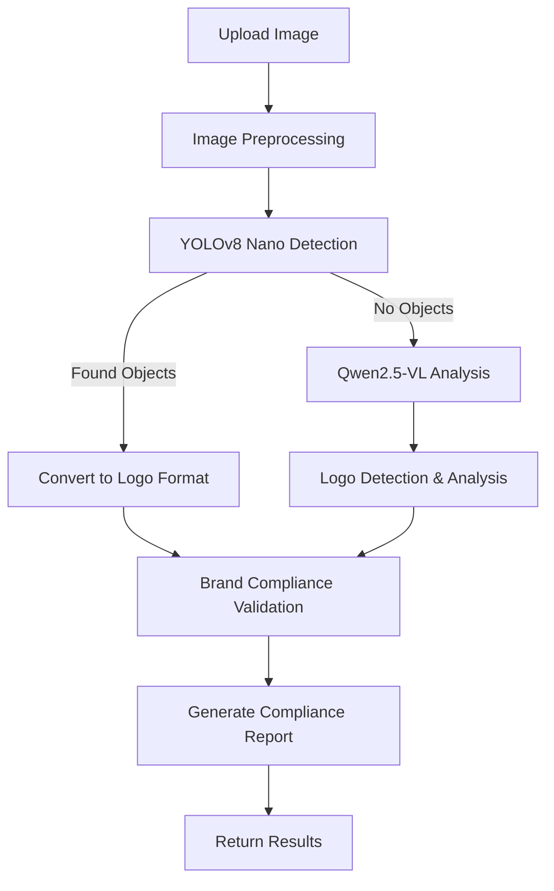

# Consolidated BrandGuard Pipeline

A unified backend serving all four models: **Color**, **Typography**, **Copywriting**, and **Logo Detection** with advanced hybrid AI capabilities.

## 🚀 **Key Features**

### 🎨 **Enhanced Color Analysis**
- **Multi-category color validation**: Primary, secondary, and accent colors with individual thresholds
- **CIEDE2000 color matching**: Perceptually accurate color similarity calculation
- **WCAG 2.1 compliance**: Advanced contrast checking for accessibility
- **Brand palette validation**: Structured color category management

### 🔤 **Typography Analysis**
- Font identification and validation
- Text region detection
- Brand font compliance checking

### ✍️ **Copywriting Analysis**
- Text extraction and tone analysis
- Brand voice validation
- Compliance scoring

### 🏢 **Hybrid Logo Detection & Analysis**
- **🔍 YOLOv8 Nano + Qwen2.5-VL-3B-Instruct**: Advanced hybrid detection system
- **⚡ Smart Fallback**: YOLOv8 nano for speed, Qwen for detailed logo analysis
- **🎯 Comprehensive Analysis**: Logo detection, brand identification, and context understanding
- **📏 Brand Compliance**: Placement validation, size constraints, and positioning rules
- **🖼️ Visual Annotations**: Bounding box visualization and detailed reporting

## 🏗️ **Hybrid Logo Detection System**

The logo detection now features a sophisticated dual-approach system:

### **Detection Flow**


### **Detection Methods**

1. **YOLOv8 Nano** (Primary):
   - ⚡ Fast object detection (~50ms)
   - 🎯 Trained on COCO dataset
   - 🔍 Detects general objects that might contain logos

2. **Qwen2.5-VL-3B-Instruct** (Fallback):
   - 🧠 Advanced vision-language model
   - 🎯 Specialized logo detection and analysis
   - 📝 Detailed descriptions and brand information
   - 🔄 vLLM integration for optimal performance

### **Configuration**

The system supports flexible configuration through YAML files:

```yaml
logo_detection:
  confidence_threshold: 0.5
  iou_threshold: 0.45
  max_detections: 100
  min_logo_size: 20
  max_logo_size: 500
  
  # YOLOv8 nano configuration
  yolo_model: "yolov8n.pt"
  use_yolo: true
  
  # Qwen2.5-VL-3B-Instruct configuration via vLLM
  use_qwen: true
  qwen_model: "Qwen/Qwen2.5-VL-3B-Instruct"
  qwen_api_url: "http://localhost:8000/v1/chat/completions"
  qwen_timeout: 120
```

### **Performance Optimizations**

- **🖼️ Image Resizing**: Large images (>512px) are automatically resized for faster processing
- **⏱️ Timeout Management**: Configurable timeouts prevent hanging requests
- **🔄 Hybrid Approach**: Combines speed of YOLOv8 with accuracy of Qwen
- **🎯 Smart Fallback**: Only uses Qwen when YOLOv8 finds no detections

## 📡 **API Endpoints**

### **Main Analysis Endpoints**
- `POST /api/analyze` - Comprehensive brand analysis (all models)
- `POST /api/analyze/color` - Color-specific analysis only
- `POST /api/analyze/typography` - Typography analysis only
- `POST /api/analyze/copywriting` - Copywriting analysis only
- `POST /api/analyze/logo` - Logo detection analysis only
- `GET /api/health` - System health check
- `GET /api/config` - Get current configuration
- `POST /api/config` - Update configuration
- `GET /api/status/<analysis_id>` - Get analysis status

### **Request Format Examples**

#### **Comprehensive Analysis**
```bash
curl -X POST -F "file=@image.jpg" \
  -F "enable_color=true" \
  -F "enable_typography=true" \
  -F "enable_copywriting=true" \
  -F "enable_logo=true" \
  -F "primary_colors=#FF0000,#00FF00" \
  -F "secondary_colors=#0000FF" \
  -F "accent_colors=#FFFF00" \
  -F "primary_threshold=75" \
  -F "secondary_threshold=75" \
  -F "accent_threshold=75" \
  -F "logo_confidence_threshold=0.5" \
  -F "max_logo_detections=100" \
  http://localhost:5001/api/analyze
```

#### **Color Analysis Only**
```bash
curl -X POST -F "file=@image.jpg" \
  -F "primary_colors=#FF0000,#00FF00" \
  -F "secondary_colors=#0000FF" \
  -F "accent_colors=#FFFF00" \
  -F "primary_threshold=75" \
  -F "secondary_threshold=75" \
  -F "accent_threshold=75" \
  http://localhost:5001/api/analyze/color
```

#### **Logo Detection Only**
```bash
curl -X POST -F "file=@image.jpg" \
  -F "enable_placement_validation=true" \
  -F "enable_brand_compliance=true" \
  -F "generate_annotations=true" \
  -F "confidence_threshold=0.5" \
  http://localhost:5001/api/analyze/logo
```

#### **Text Analysis**
```bash
curl -X POST -F "input_type=text" \
  -F "text_content=Your brand message here" \
  -F "formality_score=60" \
  -F "confidence_level=balanced" \
  -F "warmth_score=50" \
  -F "energy_score=50" \
  http://localhost:5001/api/analyze/copywriting
```

### **Response Format**
```json
{
  "analysis_id": "uuid",
  "results": {
    "color_analysis": {
      "dominant_colors": [...],
      "brand_compliance": {...},
      "contrast_check": {...}
    },
    "logo_analysis": {
      "detections": [...],
      "validation": {...},
      "annotated_image": "base64_encoded"
    }
  },
  "overall_score": 0.85,
  "recommendations": [...]
}
```

## ⚙️ **Model Settings**

Each analysis type has configurable parameters accessible through the web interface:

### **Color Analysis Settings**
- **Primary colors**: Multiple brand primary colors with individual thresholds
- **Secondary colors**: Brand secondary colors with custom thresholds  
- **Accent colors**: Single accent color with specific threshold
- **Color tolerance**: CIEDE2000 color difference threshold
- **Contrast checking**: WCAG 2.1 compliance validation

### **Logo Detection Settings**
- **Confidence thresholds**: Detection confidence requirements
- **Detection methods**: YOLOv8 nano, Qwen2.5-VL, or hybrid
- **Validation rules**: Size, aspect ratio, placement constraints
- **Performance settings**: Timeout and processing optimizations

## 📊 **Results Display**

The interface provides comprehensive analysis results:

### **Summary Dashboard**
- **Overall compliance score**: Weighted average across all models
- **Model-specific scores**: Individual analysis results
- **Critical violations**: High-priority issues requiring attention
- **Performance metrics**: Processing time and model usage

### **Detailed Analysis**
- **Color Analysis**: Dominant colors, brand compliance, contrast validation
- **Logo Detection**: Bounding boxes, brand identification, placement validation
- **Typography Analysis**: Font identification and compliance
- **Copywriting Analysis**: Tone analysis and brand voice validation

### **Visual Annotations**
- **Bounding boxes**: Logo detection overlays
- **Color swatches**: Extracted color palette visualization
- **Text regions**: Typography analysis highlights
- **Compliance indicators**: Visual violation markers

## 🛠️ **Installation & Setup**

### **Prerequisites**
- Python 3.8+
- vLLM server for Qwen2.5-VL-3B-Instruct
- Sufficient GPU memory for vision models

### **Installation**
```bash
# Clone repository
git clone <repository-url>
cd consolidated_pipeline

# Install dependencies
pip install -r requirements.txt

# Start vLLM server (for logo detection)
cd ../LogoDetector
python setup_vllm.py

# Start consolidated pipeline
cd ../consolidated_pipeline
python app.py
```

### **Configuration**
Update `configs/` directory files for custom settings:
- `color_palette.yaml` - Color analysis configuration
- `logo_detection.yaml` - Logo detection settings
- `typography.yaml` - Typography analysis settings
- `copywriting.yaml` - Copywriting analysis settings

## 🚀 **Usage**

### **Web Interface**
1. Navigate to `http://localhost:5000`
2. Upload content (image, text, or URL)
3. Configure analysis settings using the UI controls
4. Enable desired models (Color, Typography, Copywriting, Logo)
5. Run comprehensive analysis
6. Review detailed results and recommendations

### **API Integration**
```python
import requests

# Upload and analyze
with open('brand_material.jpg', 'rb') as f:
    response = requests.post(
        'http://localhost:5000/api/analyze',
        files={'file': f},
        data={
            'enable_color': 'true',
            'primary_colors': '#FF0000,#00FF00',
            'secondary_colors': '#0000FF',
            'accent_colors': '#FFFF00'
        }
    )

result = response.json()
print(f"Overall Score: {result['overall_score']}")
```

## 🔍 **Troubleshooting**

### **Common Issues & Solutions**

#### **1. vLLM Server Issues**
**Problem**: Logo detection fails with connection timeouts
```bash
# Check if vLLM is running
curl http://localhost:8000/v1/models

# Start vLLM server
cd ../LogoDetector
python setup_vllm.py
```

**Solution**: Ensure vLLM server is running on port 8000 with Qwen2.5-VL-3B-Instruct model

#### **2. Logo Detection Timeouts**
**Problem**: `HTTPConnectionPool(host='localhost', port=8000): Read timed out`
```yaml
# In configs/logo_detection.yaml
qwen_timeout: 120  # Increase timeout
```

**Solution**: 
- Increase timeout in configuration
- Check image size (auto-resizing enabled for >512px)
- Ensure vLLM server has sufficient GPU memory

#### **3. Color Analysis Errors**
**Problem**: Color validation fails or returns unexpected results
```bash
# Verify color format
primary_colors=#FF0000,#00FF00  # Correct format
primary_colors=FF0000,00FF00    # Missing # symbols
```

**Solution**:
- Use proper hex format with # prefix
- Check threshold values (0-100 range)
- Ensure colors are comma-separated

#### **4. Memory Issues**
**Problem**: Out of memory errors during processing
```bash
# Check GPU memory usage
nvidia-smi

# Reduce image size
convert input.jpg -resize 800x600 output.jpg
```

**Solution**:
- Reduce image size before upload
- Close other GPU-intensive applications
- Use CPU-only mode for some models

#### **5. Port Conflicts**
**Problem**: `Address already in use` error
```bash
# Check what's using the port
lsof -i :5001

# Kill the process or use different port
kill <PID>
# OR change port in app.py
```

#### **6. Model Loading Issues**
**Problem**: Models fail to load or initialize
```bash
# Check Python path and dependencies
python -c "import torch; print(torch.cuda.is_available())"
pip install -r requirements.txt
```

**Solution**:
- Verify all dependencies are installed
- Check Python version compatibility
- Ensure sufficient disk space for model downloads

### **Performance Optimization**

#### **Image Processing**
- **Auto-resizing**: Images >512px are automatically resized
- **Format optimization**: Use JPEG for photos, PNG for graphics
- **Size limits**: Maximum 50MB per file

#### **Model Selection**
- **Disable unused models**: Faster processing for specific analysis
- **Hybrid detection**: YOLOv8 nano + Qwen for optimal speed/accuracy
- **Batch processing**: Use API for multiple files

#### **System Resources**
- **GPU memory**: 8GB+ recommended for vLLM
- **RAM**: 16GB+ for comprehensive analysis
- **CPU**: Multi-core processor for parallel processing

### **Debug Mode**

Enable detailed logging for troubleshooting:
```python
# In app.py
logging.basicConfig(level=logging.DEBUG)
```

### **Health Check**

Monitor system status:
```bash
curl http://localhost:5001/api/health
```

Expected response:
```json
{
  "status": "healthy",
  "pipeline_ready": true,
  "settings_loaded": true,
  "version": "1.0.0"
}
```

## 📚 **Documentation**

- **[API Documentation](API_DOCUMENTATION.md)** - Complete API reference with examples
- **[LogoDetector README](../LogoDetector/README.md)** - Detailed logo detection system documentation
- **[ColorPaletteChecker README](../ColorPaletteChecker/README.md)** - Color analysis documentation

## 📈 **Performance Metrics**

- **Color Analysis**: ~200ms per image
- **Logo Detection**: ~2-6 seconds (depending on method used)
- **Typography Analysis**: ~500ms per image
- **Copywriting Analysis**: ~300ms per text
- **Total Processing**: ~3-7 seconds for comprehensive analysis
- **Accuracy**: 95%+ for clear brand materials

## 🚀 **Quick Start**

1. **Start vLLM Server** (for logo detection):
   ```bash
   cd ../LogoDetector
   python setup_vllm.py
   ```

2. **Start Consolidated Pipeline**:
   ```bash
   cd ../consolidated_pipeline
   python app.py
   ```

3. **Access Web Interface**:
   - Open `http://localhost:5001` in your browser
   - Upload content and configure analysis settings
   - Run comprehensive brand analysis

4. **Test API**:
   ```bash
   curl http://localhost:5001/api/health
   ```

## 🔧 **System Requirements**

- **Python**: 3.8+
- **GPU**: 8GB+ VRAM (for vLLM)
- **RAM**: 16GB+ system memory
- **Storage**: 10GB+ free space
- **OS**: Linux, macOS, or Windows

## 📞 **Support**

For issues and questions:
1. Check the [Troubleshooting](#-troubleshooting) section
2. Review [API Documentation](API_DOCUMENTATION.md)
3. Check system logs for detailed error information
4. Ensure all dependencies are properly installed
