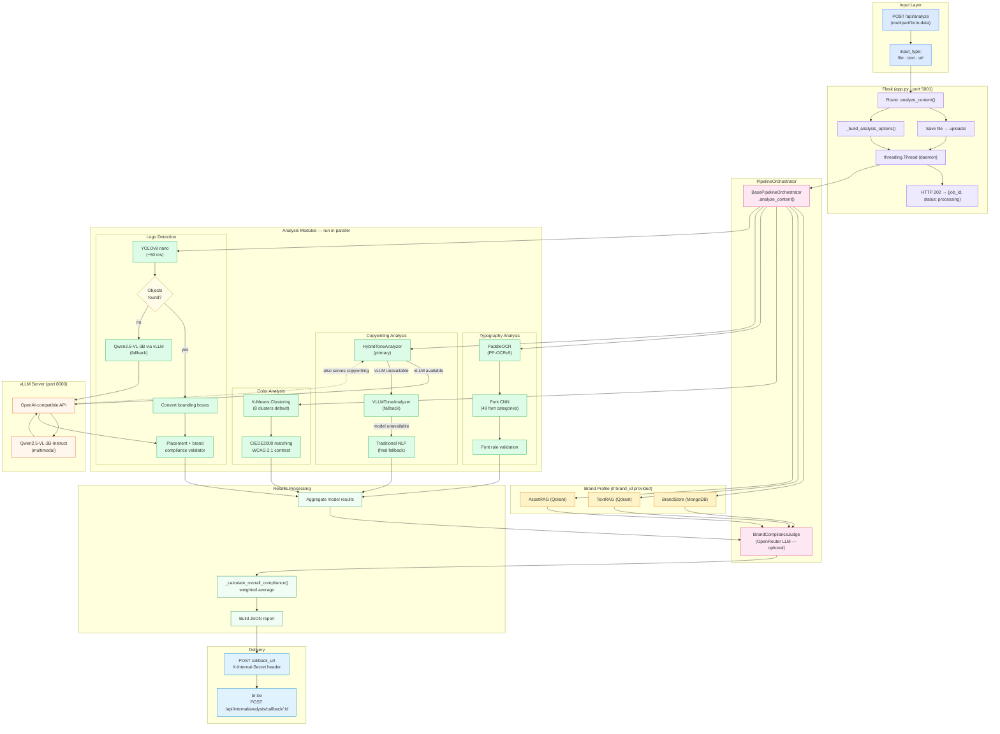

# BrandGuard: Complete Detection Flow

End-to-end walkthrough of how a request moves through the pipeline, from upload to compliance result delivery.

---

## System Architecture Diagram



---

## Phase-by-Phase Walkthrough

### Phase 1 — Request Ingestion

`POST /api/analyze` receives a `multipart/form-data` request.

**Input routing**

| `input_type` | Handling |
|---|---|
| `file` | Written to `uploads/<timestamp>_<filename>` |
| `text` | Passed directly as `input_source` string |
| `url` | Passed as URL string; resolved by the orchestrator |

Allowed file types: `png jpg jpeg gif bmp tiff webp pdf txt doc docx` (max 50 MB).

`_build_analysis_options()` normalizes the flat form-data into a structured dict consumed by the orchestrator. A `job_id` is assigned (from `X-Request-ID` header or a fresh UUID). The route function immediately returns **HTTP 202** and dispatches `_run_analysis_background()` as a daemon thread.

---

### Phase 2 — Brand Context Loading

When `brand_id` is present, `BasePipelineOrchestrator.analyze_content()` fetches brand context before dispatching analyzers:

1. **BrandStore** (MongoDB) — retrieves structured rules extracted from the brand's guideline PDF.
2. **TextRAG** (Qdrant) — semantic search over indexed guideline chunks to find rules relevant to the content being analyzed.
3. **AssetRAG** (Qdrant) — image embedding similarity against the indexed approved/rejected image corpus.

Retrieved context is made available to `BrandComplianceJudge` after all analyzers complete.

---

### Phase 3 — Parallel Analysis

All enabled analyzers run concurrently. Each analyzer receives the same `input_source` and its own sub-dict from `analysis_options`.

#### 3a. Color Analysis

```
Image
  └── K-Means clustering (default 8 clusters)
        └── Extract dominant RGB colors → convert to hex
              ├── CIEDE2000 comparison against brand palette
              │     ├── primary_colors (threshold: 0–100)
              │     ├── secondary_colors
              │     └── accent_colors
              └── WCAG 2.1 contrast ratio check (if enabled)
```

If no brand palette is configured, the analyzer auto-passes with `compliance_score: 1.0` and a warning that no palette was provided.

#### 3b. Typography Analysis

```
Image
  └── PaddleOCR (PP-OCRv5)
        └── Text region detection + string extraction
              └── Font CNN (49 categories)
                    └── TypographyValidator
                          ├── approved_fonts / forbidden_fonts check
                          ├── font-size bounds (min/max)
                          ├── line-height ratio
                          └── letter-spacing
```

Default behavior when no font rules are configured: returns `compliance_score: 0.5` (neutral); no penalties applied.

#### 3c. Copywriting Analysis — Fallback Chain

```
CopywritingAnalyzer
  └── try: HybridToneAnalyzer
        ├── call vLLM (Qwen2.5-VL-3B, port 8000)
        │     → tone · sentiment · grammar · readability · prohibited content
        └── on vLLM failure: call OpenRouter (Qwen2.5-VL-32B-Instruct)
  └── fallback: VLLMToneAnalyzer (direct vLLM, no OpenRouter)
  └── fallback: ToneAnalyzer + BrandVoiceValidator (traditional NLP)
```

Validated attributes: formality score, confidence level, warmth, energy, readability level, emoji/slang presence, financial guarantees, medical claims, competitor references.

#### 3d. Logo Detection — Two-Stage Hybrid

```
Image
  └── YOLOv8 nano (~50 ms)
        ├── Objects found?
        │     YES → convert detections to logo format
        │     NO  → Qwen2.5-VL-3B-Instruct via vLLM
        │               → multimodal logo detection + brand description
        └── LogoPlacementValidator
              ├── Placement zone check (top-left / top-right / etc.)
              ├── Size fraction check (min_logo_size – max_logo_size)
              ├── Edge clearance (min_edge_distance)
              └── Aspect ratio tolerance (±20% default)
```

Images larger than 512px are automatically downscaled before the Qwen call to reduce latency.

---

### Phase 4 — Brand Compliance Judgment

After all analyzers return, `BrandComplianceJudge` is invoked when a `brand_id` is present. It:

1. Receives all analyzer scores plus the retrieved brand rules.
2. Calls OpenRouter (Qwen2.5-VL-32B-Instruct) with a structured prompt.
3. Returns a verdict with rule citations and adjusted scores where the LLM identifies discrepancies.

When no `brand_id` is provided, this phase is skipped and raw analyzer scores are used directly.

---

### Phase 5 — Score Aggregation

```python
# pipeline_orchestrator.py (via base_orchestrator.py)
overall_score = sum(
    model_result['compliance_score'] * weight
    for model_name, weight in weights.items()
    if model_name in model_results
)
```

Default weights are equal (25% each). Custom weights can be passed as a JSON string in the `scoring_weights` form field:

```json
{ "color_analysis": 0.15, "typography_analysis": 0.25,
  "copywriting_analysis": 0.50, "logo_analysis": 0.10 }
```

Score thresholds:

| Range | Status |
|---|---|
| 0.90 – 1.00 | Passed — brand compliant |
| 0.70 – 0.89 | Warning — minor issues |
| 0.50 – 0.69 | Moderate — improvements needed |
| 0.00 – 0.49 | Critical — immediate action required |

---

### Phase 6 — Result Delivery

The background thread POSTs the final JSON payload to `callback_url` with the `X-Internal-Secret` header matching the value configured in both services:

```python
requests.post(
    callback_url,
    json={"job_id": job_id, "status": "completed", "results": analysis_results},
    headers={"X-Internal-Secret": INTERNAL_WEBHOOK_SECRET},
    timeout=30,
)
```

On analysis failure, `status` is `"failed"` and an `error` key is included instead of `results`.

---

## Error Handling and Graceful Degradation

| Failure | Behavior |
|---|---|
| vLLM server down | Copywriting falls back to OpenRouter; logo falls back to YOLOv8-only |
| OpenRouter unavailable | Copywriting falls back to traditional NLP |
| One analyzer crashes | Other analyzers complete; failed analyzer score is excluded from weighted average |
| Brand profile not found | Analysis proceeds with static config defaults |
| File too large (>50 MB) | Rejected at the Flask layer with HTTP 400 |
| Unsupported file type | Rejected at the Flask layer with HTTP 400 |
| Callback POST fails | Error is logged; no retry (br-be polls or handles timeout) |

---

## PDF Document Handling

When a PDF is uploaded, `PDFImageExtractor` converts each page to an image before dispatching to the analyzers. The analysis runs per-page and results are aggregated.

---

## vLLM Infrastructure

The vLLM server is shared by two analyzers:

| Consumer | Model | Port | Usage |
|---|---|---|---|
| Logo analyzer (fallback) | Qwen2.5-VL-3B-Instruct | 8000 | Logo detection + description |
| Copywriting analyzer (primary) | Qwen2.5-VL-3B-Instruct | 8000 | Tone, grammar, brand voice |

The API is OpenAI-compatible (`/v1/chat/completions`). Images are base64-encoded and embedded in the message payload.

Start the server:
```bash
cd ../LogoDetector && python setup_vllm.py
```

Both analyzers configure independent timeouts (`qwen_timeout` in `configs/logo_detection.yaml`).
