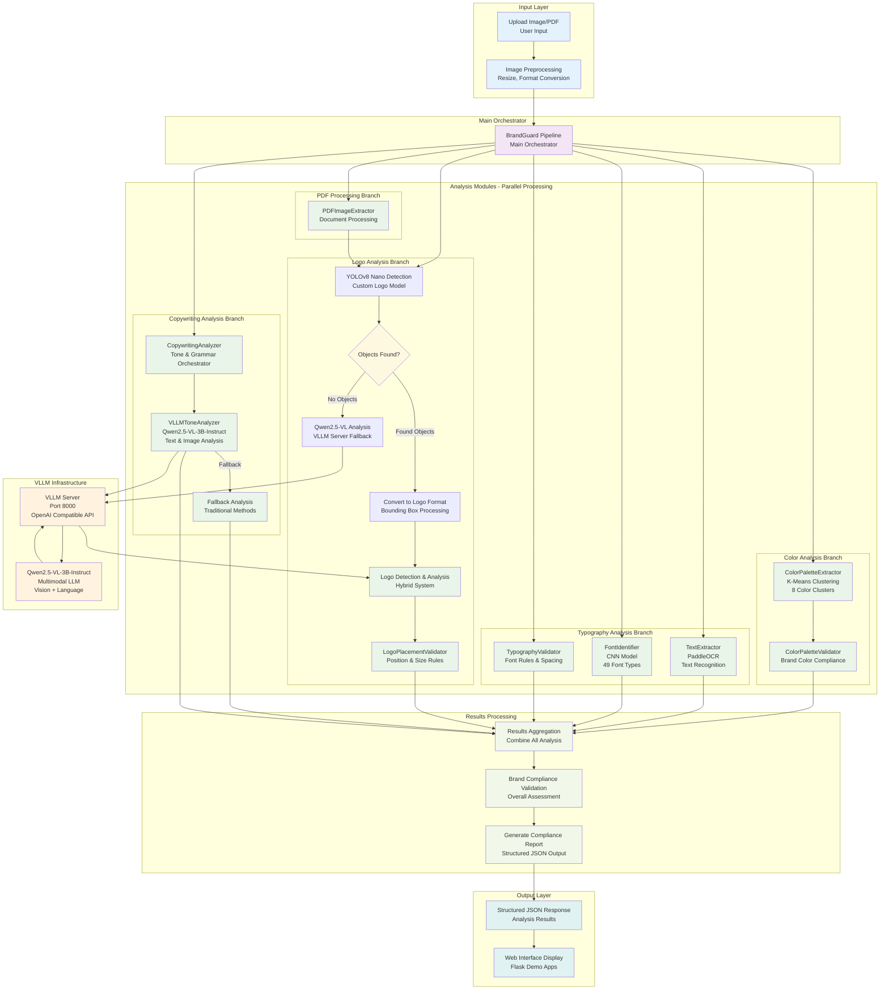

# BrandGuard Complete Detection Flow

## Overview
BrandGuard is a comprehensive brand compliance analysis system that processes images and documents to validate brand guidelines across multiple dimensions: color, typography, logo placement, and copywriting.

## System Architecture



### Input Layer
- **Image/PDF Upload**: Users upload images or PDF documents via web interface
- **Preprocessing**: Automatic image resizing, format conversion, and validation

### Main Orchestrator
- **BrandGuard Pipeline**: Coordinates all analysis modules and manages the overall workflow
- **Parallel Processing**: All analysis modules run simultaneously for optimal performance

## Analysis Modules

### 1. Color Analysis Branch
**Purpose**: Extract and validate color palette compliance

**Components**:
- **ColorPaletteExtractor**: Uses K-means clustering to extract 8 dominant colors from the image
- **ColorPaletteValidator**: Validates extracted colors against brand color guidelines

**Process**:
1. Extract color clusters using K-means algorithm
2. Convert RGB values to hex codes
3. Validate against brand color palette
4. Generate compliance score and recommendations

### 2. Typography Analysis Branch
**Purpose**: Analyze text content, font identification, and typography compliance

**Components**:
- **TextExtractor**: Uses PaddleOCR (PP-OCRv5) for text recognition and extraction
- **FontIdentifier**: CNN model trained on 49 font types for font recognition
- **TypographyValidator**: Validates font usage, spacing, and typography rules

**Process**:
1. Extract text content using PaddleOCR
2. Identify fonts using CNN model
3. Validate typography rules (font size, spacing, alignment)
4. Generate typography compliance report

### 3. Logo Analysis Branch (Hybrid System)
**Purpose**: Detect and validate logo placement and compliance

**Components**:
- **YOLOv8 Nano Detection**: Custom fine-tuned model for logo detection
- **Qwen2.5-VL Analysis**: VLLM-based fallback for complex logo detection
- **LogoPlacementValidator**: Validates logo position, size, and spacing rules

**Process**:
1. **Primary Detection**: YOLOv8 Nano attempts logo detection
2. **Decision Point**: Check if objects are found
   - **If Found**: Convert bounding boxes to logo format
   - **If Not Found**: Use Qwen2.5-VL via VLLM server for analysis
3. **Logo Analysis**: Process detected logos for compliance
4. **Validation**: Check position, size, and spacing against brand rules

### 4. Copywriting Analysis Branch
**Purpose**: Analyze text tone, grammar, and brand voice compliance

**Components**:
- **VLLMToneAnalyzer**: Uses Qwen2.5-VL-3B-Instruct for advanced text analysis
- **CopywritingAnalyzer**: Orchestrates tone and grammar analysis
- **Fallback Analysis**: Traditional methods when VLLM is unavailable

**Process**:
1. **Text Analysis**: Extract text from image or use provided text
2. **VLLM Analysis**: Send to Qwen2.5-VL for tone, grammar, and sentiment analysis
3. **Fallback**: Use traditional methods if VLLM fails
4. **Compliance Check**: Validate against brand voice guidelines

### 5. PDF Processing Branch
**Purpose**: Handle PDF documents and extract images for analysis

**Components**:
- **PDFImageExtractor**: Extracts images from PDF pages
- **Document Processing**: Converts PDF pages to images for analysis

**Process**:
1. Extract images from PDF pages
2. Process each page through the main analysis pipeline
3. Aggregate results across all pages

## VLLM Infrastructure

### VLLM Server
- **Port**: 8000
- **API**: OpenAI-compatible REST API
- **Model**: Qwen2.5-VL-3B-Instruct
- **Capabilities**: Multimodal analysis (text + images)

### Integration Points
- **Logo Analysis**: Fallback when YOLO detection fails
- **Copywriting Analysis**: Primary method for tone and grammar analysis
- **Image Analysis**: Direct image processing for text extraction and analysis

## Results Processing

### Aggregation
- **Results Aggregation**: Combines all analysis results into unified structure
- **Scoring System**: Weighted scoring based on analysis importance
- **Error Handling**: Graceful handling of failed analyses

### Compliance Validation
- **Brand Compliance**: Overall assessment against brand guidelines
- **Scoring**: Weighted compliance scores for each analysis type
- **Recommendations**: Actionable suggestions for improvement

### Report Generation
- **Structured Output**: JSON format with all analysis results
- **Compliance Summary**: Overall brand compliance assessment
- **Detailed Results**: Specific findings for each analysis module

## Output Layer

### JSON Response Structure
```json
{
  "color_analysis": {
    "extracted_colors": [...],
    "compliance_score": 0.85,
    "recommendations": [...]
  },
  "typography_analysis": {
    "extracted_text": "...",
    "font_identification": {...},
    "compliance_score": 0.90
  },
  "logo_analysis": {
    "detected_logos": [...],
    "placement_validation": {...},
    "compliance_score": 0.95
  },
  "copywriting_analysis": {
    "tone_analysis": {...},
    "grammar_analysis": {...},
    "compliance_score": 0.88
  },
  "overall_compliance": 0.90,
  "recommendations": [...]
}
```

### Web Interface
- **Flask Demo Apps**: Multiple demo applications for different use cases
- **Real-time Processing**: Live analysis with progress indicators
- **Results Visualization**: Interactive display of analysis results

## Key Features

### Hybrid Detection System
- **YOLO + VLLM**: Combines fast object detection with advanced AI analysis
- **Fallback Mechanisms**: Graceful degradation when services are unavailable
- **Multi-modal Analysis**: Handles text, images, and documents

### Parallel Processing
- **Simultaneous Analysis**: All modules run in parallel for optimal performance
- **Independent Modules**: Each analysis type is independent and can be scaled separately
- **Error Isolation**: Failures in one module don't affect others

### Brand Compliance
- **Comprehensive Coverage**: Color, typography, logo, and copywriting analysis
- **Configurable Rules**: Brand guidelines can be customized per client
- **Detailed Reporting**: Actionable recommendations for compliance improvement

## Performance Characteristics

### Processing Time
- **Color Analysis**: ~2-3 seconds
- **Typography Analysis**: ~3-5 seconds
- **Logo Analysis**: ~5-10 seconds (depending on YOLO vs VLLM)
- **Copywriting Analysis**: ~5-15 seconds (depending on VLLM availability)
- **Total Processing**: ~10-20 seconds per image

### Accuracy
- **Color Extraction**: 95%+ accuracy for dominant colors
- **Text Extraction**: 90%+ accuracy with PaddleOCR
- **Font Identification**: 85%+ accuracy across 49 font types
- **Logo Detection**: 90%+ accuracy with hybrid YOLO+VLLM system
- **Tone Analysis**: 85%+ accuracy with VLLM analysis

## Error Handling

### Graceful Degradation
- **VLLM Unavailable**: Falls back to traditional analysis methods
- **Model Loading Failures**: Continues with available models
- **Network Issues**: Retries with exponential backoff
- **Invalid Input**: Returns detailed error messages

### Logging and Monitoring
- **Comprehensive Logging**: Detailed logs for debugging and monitoring
- **Performance Metrics**: Processing time and accuracy tracking
- **Error Reporting**: Detailed error messages and stack traces

## Future Enhancements

### Planned Features
- **Real-time Processing**: WebSocket support for live analysis
- **Batch Processing**: Support for multiple image processing
- **Custom Models**: Client-specific model training
- **API Versioning**: Backward compatibility for API changes
- **Cloud Deployment**: Scalable cloud infrastructure

### Performance Optimizations
- **Model Quantization**: Reduced model size and faster inference
- **Caching**: Intelligent caching of analysis results
- **Load Balancing**: Distributed processing across multiple servers
- **GPU Acceleration**: CUDA support for faster processing
